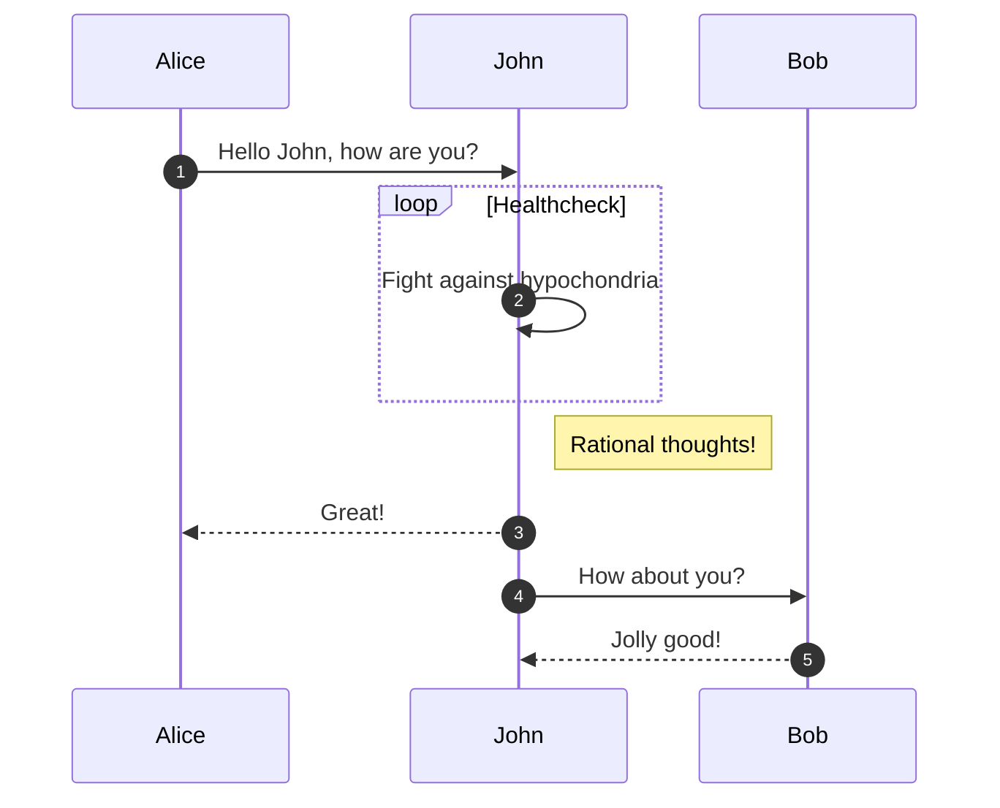

# 基本使用

## 提示框

### 基本使用

!!! note "这是一个标题"

    这是提示框内容

!!! note ""

    也可以没有标题

??? note "可以默认折叠"

    这是提示框内容

???+ note "也可以默认展开"

    这是提示框内容

### 各种状态

!!! note "note"

    这是提示框内容

!!! abstract "abstract"

    这是提示框内容

!!! info "info"

    这是提示框内容

!!! tip "tip"

    这是提示框内容

!!! success "success"

    这是提示框内容

!!! question "question"

    这是提示框内容

!!! warning "warning"

    这是提示框内容

!!! failure "failure"

    这是提示框内容

!!! danger "danger"

    这是提示框内容

!!! bug "bug"

    这是提示框内容

!!! example "example"

    这是提示框内容

!!! quote "quote"

    这是提示框内容


## 点击悬浮提示

Lorem ipsum dolor sit amet, (1) consectetur adipiscing elit.
{ .annotate }

1.  :man_raising_hand: I'm an annotation! (1)
    { .annotate }

    1.  :woman_raising_hand: I'm an annotation as well!

## 代码块

可以设置如下内容
1. 标题
2. 行号
3. 高亮
4. 代码复制按钮

```java title="SysDictLogicAspect" linenums="1" hl_lines="11-13 16 21"
package com.laolang.jx.module.system.dict.aop;

import org.aspectj.lang.JoinPoint;
import org.aspectj.lang.annotation.After;
import org.aspectj.lang.annotation.Aspect;
import org.aspectj.lang.annotation.Before;
import org.springframework.stereotype.Component;

import lombok.extern.slf4j.Slf4j;

@Slf4j
@Aspect
@Component
public class SysDictLogicAspect {

	@Before("execution(public * com.laolang.jx.module.system..logic.SysDictTypeLogic.* (..))")log.info("{} pre handler",
	public void preHandler(JoinPoint joinPoint) {
		log.info("{} pre handler", joinPoint.getSignature().getName());
	}

	@After("execution(public * com.laolang.jx.module.system..logic.*.* (..))")
	public void postHandler(JoinPoint joinPoint) {
		log.info("{} post handler", joinPoint.getSignature().getName());
	}
}
```

## tabs

=== "C"

    ``` c
    #include <stdio.h>

    int main(void) {
      printf("Hello world!\n");
      return 0;
    }
    ```

=== "C++"

    ``` c++
    #include <iostream>

    int main(void) {
      std::cout << "Hello world!" << std::endl;
      return 0;
    }
    ```

!!! example

    === "Unordered List"

        ``` markdown
        * Sed sagittis eleifend rutrum
        * Donec vitae suscipit est
        * Nulla tempor lobortis orci
        ```

    === "Ordered List"

        ``` markdown
        1. Sed sagittis eleifend rutrum
        2. Donec vitae suscipit est
        3. Nulla tempor lobortis orci
        ```

## 表格

=== "左对齐"
    | Method      | Description                          |
    | :---------- | :----------------------------------- |
    | `GET`       | :material-check:     Fetch resource  |
    | `PUT`       | :material-check-all: Update resource |
    | `DELETE`    | :material-close:     Delete resource |

=== "居中对齐"
    | Method      | Description                          |
    | :---------: | :----------------------------------: |
    | `GET`       | :material-check:     Fetch resource  |
    | `PUT`       | :material-check-all: Update resource |
    | `DELETE`    | :material-close:     Delete resource |

=== "右对齐"
    | Method      | Description                          |
    | ----------: | -----------------------------------: |
    | `GET`       | :material-check:     Fetch resource  |
    | `PUT`       | :material-check-all: Update resource |
    | `DELETE`    | :material-close:     Delete resource |

## 绘图

### mermaid



## 脚注

Lorem ipsum[^1] dolor sit amet, consectetur adipiscing elit.[^2]


## 格式化

### 基本使用

Text can be {--deleted--} and replacement text {++added++}. This can also be
combined into {~~one~>a single~~} operation. {==Highlighting==} is also
possible {>>and comments can be added inline<<}.

{==

Formatting can also be applied to blocks by putting the opening and closing
tags on separate lines and adding new lines between the tags and the content.

==}

### 格式化快捷键

++ctrl+alt+del++

## grid 布局

### 基本使用

<div class="grid cards" markdown>

- :fontawesome-brands-html5: __HTML__ for content and structure
- :fontawesome-brands-js: __JavaScript__ for interactivity
- :fontawesome-brands-css3: __CSS__ for text running out of boxes
- :fontawesome-brands-internet-explorer: __Internet Explorer__ ... huh?

</div>

### 卡片样式

<div class="grid cards" markdown>

-   :material-clock-fast:{ .lg .middle } __Set up in 5 minutes__

    ---

    Install [`mkdocs-material`](#) with [`pip`](#) and get up
    and running in minutes

    [:octicons-arrow-right-24: Getting started](#)

-   :fontawesome-brands-markdown:{ .lg .middle } __It's just Markdown__

    ---

    Focus on your content and generate a responsive and searchable static site

    [:octicons-arrow-right-24: Reference](#)

-   :material-format-font:{ .lg .middle } __Made to measure__

    ---

    Change the colors, fonts, language, icons, logo and more with a few lines

    [:octicons-arrow-right-24: Customization](#)

-   :material-scale-balance:{ .lg .middle } __Open Source, MIT__

    ---

    Material for MkDocs is licensed under MIT and available on [GitHub]

    [:octicons-arrow-right-24: License](#)

</div>

## 图片


也可以居中

<figure markdown="span">
  { width="300" }
  <figcaption>Image caption</figcaption>
</figure>


## 列表
### 基本使用
1.  Vivamus id mi enim. Integer id turpis sapien. Ut condimentum lobortis
    sagittis. Aliquam purus tellus, faucibus eget urna at, iaculis venenatis
    nulla. Vivamus a pharetra leo.

    1.  Vivamus venenatis porttitor tortor sit amet rutrum. Pellentesque aliquet
        quam enim, eu volutpat urna rutrum a. Nam vehicula nunc mauris, a
        ultricies libero efficitur sed.

    2.  Morbi eget dapibus felis. Vivamus venenatis porttitor tortor sit amet
        rutrum. Pellentesque aliquet quam enim, eu volutpat urna rutrum a.

        1.  Mauris dictum mi lacus
        2.  Ut sit amet placerat ante
        3.  Suspendisse ac eros arcu

### 任务列表

- [x] Lorem ipsum dolor sit amet, consectetur adipiscing elit
- [ ] Vestibulum convallis sit amet nisi a tincidunt
    * [x] In hac habitasse platea dictumst
    * [x] In scelerisque nibh non dolor mollis congue sed et metus
    * [ ] Praesent sed risus massa
- [ ] Aenean pretium efficitur erat, donec pharetra, ligula non scelerisque


## 悬浮提示

### 基本使用

[Hover me][example]

  [example]: https://example.com "I'm a tooltip!"


---


[^1]: Lorem ipsum dolor sit amet, consectetur adipiscing elit.


[^2]:
    Lorem ipsum dolor sit amet, consectetur adipiscing elit. Nulla et euismod
    nulla. Curabitur feugiat, tortor non consequat finibus, justo purus auctor
    massa, nec semper lorem quam in massa.
